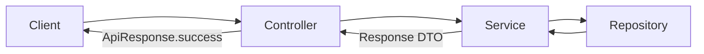

# Backend API 개발 가이드

이 문서는 새로운 Spring Boot API를 프로젝트의 공통 응답·예외 처리 방식에 맞춰 개발하는 절차를 설명합니다. 구현 예시는 [Ping API 가이드](./backend-ping-guide.md), 공통 타입의 상세 계약은 [Backend 공통 설정 가이드](./backend-common-settings.md)를 참고합니다.

## 핵심 규칙

새 API를 개발할 때 다음 규칙을 먼저 적용합니다.

1. 기능 단위 도메인 패키지를 만듭니다.
2. Controller는 HTTP 요청·응답만 담당합니다.
3. Service는 응답 DTO를 반환하거나 `BusinessException`을 발생시킵니다.
4. 성공 응답은 Controller에서 `ApiResponse.success(...)`로 감쌉니다.
5. 도메인 오류는 도메인별 `ErrorCode` enum으로 정의합니다.
6. 요청값은 요청 DTO와 Bean Validation으로 검증합니다.
7. 예상하지 못한 예외의 내부 정보는 클라이언트에 노출하지 않습니다.
8. 테스트를 먼저 작성하고 예상한 이유로 실패하는지 확인한 뒤 구현합니다.

## 문서별 역할

| 문서 | 확인할 내용 |
| --- | --- |
| 이 문서 | 새 API의 설계, 구현 순서, 계층별 책임, 테스트와 완료 조건 |
| [Backend 공통 설정 가이드](./backend-common-settings.md) | `ApiResponse`, 공통 오류 코드, 전역 예외 처리, JPA Auditing 상세 규칙 |
| [Ping API 가이드](./backend-ping-guide.md) | 실제 실행 가능한 정상·검증·비즈니스·서버 오류 예제 |
| [Code Convention](./code-convention.md) | 프로젝트 전체 이름, 구조, API, 오류 처리, 테스트 규칙 |

문서와 실제 코드 또는 빌드 설정이 다르면 임의로 한쪽을 선택하지 말고 정책 충돌로 공유합니다.

## 개발 전 API 계약 정하기

코드를 작성하기 전에 다음 항목을 정합니다.

- HTTP method와 URL
- 정상 응답의 HTTP 상태와 응답 DTO
- 요청 DTO의 필드와 검증 규칙
- 존재하지 않음, 중복, 허용되지 않는 상태 등 비즈니스 오류
- 각 비즈니스 오류의 HTTP 상태, 오류 코드, 안전한 메시지
- 트랜잭션 경계와 Repository 사용 여부
- 개발 환경에서만 제공해야 하는 API인지 여부

예를 들어 쿠폰 생성 API라면 다음처럼 계약을 먼저 정합니다.

```text
POST /api/coupons
정상: 201 Created + ApiResponse<CouponResponse>
검증 실패: 400 Bad Request + COMMON-001
코드 중복: 409 Conflict + COUPON-001
```

## 패키지 구조

도메인 기능은 기술 종류별 전역 패키지가 아니라 기능 단위로 묶습니다.

```text
org.ssafy.b102.backend.coupon
├── controller
│   └── CouponController.java
├── dto
│   ├── CreateCouponRequest.java
│   └── CouponResponse.java
├── entity
│   └── Coupon.java
├── exception
│   └── CouponErrorCode.java
├── repository
│   └── CouponRepository.java
└── service
    └── CouponService.java
```

DB를 사용하지 않는 기능에는 `entity`와 `repository`를 만들지 않습니다. 실제로 두 개 이상의 도메인에서 재사용되기 전에는 구현을 `global`로 이동하지 않습니다.

## 계층별 책임

| 계층 | 책임 | 반환하거나 발생시키는 값 |
| --- | --- | --- |
| Controller | URL, HTTP method, 요청 역직렬화, `@Valid`, HTTP 상태, 성공 응답 래핑 | `ResponseEntity<ApiResponse<ResponseDto>>` |
| Service | 비즈니스 규칙, 트랜잭션, Entity와 DTO 변환 | 응답 DTO 또는 `BusinessException` |
| Repository | 데이터 저장과 조회 | Entity, `Optional<Entity>`, 조회 결과 |
| Request DTO | 외부 입력 구조와 Bean Validation | 검증된 입력값 |
| Response DTO | 클라이언트에 공개할 데이터 | 불변 응답 데이터 |
| Domain ErrorCode | 도메인 오류의 HTTP 상태, 코드, 안전한 메시지 | `ErrorCode` 구현 값 |
| GlobalExceptionHandler | 예외를 공통 오류 응답으로 변환 | 오류 유형에 맞는 `ApiResponse<?>` |

Service와 Repository에서는 다음 타입을 반환하지 않습니다.

- `ApiResponse`
- `ResponseEntity`
- HTTP 상태 코드
- Controller 전용 타입

의존 방향은 다음과 같이 유지합니다.

```text
Controller → Service → Repository → Database
```

## API 동작 흐름

### 정상 응답



Controller가 Service의 응답 DTO를 받아 성공 응답을 만듭니다. 생성 API는 `201 Created`, 일반 조회·수정 API는 `200 OK`를 사용합니다.

### 요청값 검증 실패

```text
Request DTO의 Bean Validation 실패
→ MethodArgumentNotValidException
→ GlobalExceptionHandler
→ 400 Bad Request + COMMON-001 + data.fieldErrors
```

검증은 Controller가 호출되기 전에 끝납니다. 클라이언트가 보낸 `rejectedValue`는 비밀번호나 토큰 노출 위험이 있으므로 오류 응답에 넣지 않습니다.

### 비즈니스 오류

```text
Service가 비즈니스 규칙 위반 확인
→ BusinessException(DomainErrorCode)
→ GlobalExceptionHandler
→ ErrorCode에 정의한 HTTP 상태와 ApiResponse 오류 본문
```

Controller에서 `try-catch`로 `BusinessException`을 다시 포장하지 않습니다.

### 예상하지 못한 오류

```text
처리되지 않은 Exception
→ GlobalExceptionHandler
→ 서버 로그에 stack trace 기록
→ 500 Internal Server Error + COMMON-500
```

내부 예외 메시지, SQL, 파일 경로, stack trace를 응답에 포함하지 않습니다.

## 구현 예시

### 요청 DTO와 검증

```java
public record CreateCouponRequest(
	@NotBlank(message = "쿠폰 코드는 필수입니다.")
	String code
) {
}
```

Controller의 요청 DTO에는 `@Valid`를 적용합니다.

```java
@PostMapping
public ResponseEntity<ApiResponse<CouponResponse>> createCoupon(
	@Valid @RequestBody CreateCouponRequest request
) {
	CouponResponse response = couponService.createCoupon(request);

	return ResponseEntity.status(HttpStatus.CREATED)
		.body(ApiResponse.success(response));
}
```

### 도메인 오류 코드

공통 오류가 아닌 쿠폰 도메인 오류는 `CommonErrorCode`에 추가하지 않고 쿠폰 패키지에 둡니다.

```java
public enum CouponErrorCode implements ErrorCode {

	CODE_ALREADY_EXISTS(
		HttpStatus.CONFLICT,
		"COUPON-001",
		"이미 사용 중인 쿠폰 코드입니다."
	);

	// ErrorCode 구현
}
```

오류 코드는 `<DOMAIN>-<NUMBER>` 형식을 사용합니다. 배포된 코드의 의미를 변경하거나 다른 오류에 재사용하지 않습니다.

### Service의 비즈니스 예외

```java
@Transactional
public CouponResponse createCoupon(CreateCouponRequest request) {
	if (couponRepository.existsByCode(request.code())) {
		throw new BusinessException(CouponErrorCode.CODE_ALREADY_EXISTS);
	}

	Coupon coupon = couponRepository.save(Coupon.create(request.code()));
	return CouponResponse.from(coupon);
}
```

조회 전용 메서드에는 `@Transactional(readOnly = true)`를 사용합니다. DB unique constraint는 동시 요청에 대한 최종 방어선으로 유지하고, 필요한 경우 해당 예외도 도메인 오류로 안전하게 변환합니다.

## 권장 구현 순서

각 동작마다 RED-GREEN-REFACTOR를 반복합니다.

1. API 계약과 도메인 오류 코드를 정합니다.
2. 요청·응답 DTO의 형태를 정합니다.
3. Service 정상 동작 테스트를 작성합니다.
4. 테스트가 기능 미구현 때문에 실패하는지 확인합니다.
5. 테스트를 통과하는 최소 Service 구현을 작성합니다.
6. 비즈니스 오류 Service 테스트를 작성하고 같은 과정을 반복합니다.
7. Controller 정상 응답 테스트를 작성합니다.
8. HTTP 상태와 `ApiResponse` JSON 계약을 만족하는 최소 Controller를 작성합니다.
9. 검증 실패와 오류 응답 테스트를 추가합니다.
10. Repository 또는 DB 연동이 있으면 필요한 통합 테스트를 추가합니다.
11. 중복을 정리하되 테스트가 계속 통과하는지 확인합니다.
12. 관련 테스트, 전체 테스트, 빌드를 순서대로 실행합니다.

테스트를 구현 뒤에 한꺼번에 추가하면 테스트가 처음부터 통과하여 요구사항을 실제로 검증하는지 확인하기 어렵습니다. 반드시 테스트가 예상한 이유로 실패하는 RED 상태를 먼저 확인합니다.

## 테스트 범위

### Service 단위 테스트

다음을 검증합니다.

- 정상 입력이 올바른 응답 DTO로 변환되는지
- 존재하지 않음, 중복, 허용되지 않는 상태에서 올바른 도메인 `ErrorCode`를 가진 `BusinessException`이 발생하는지
- 저장이나 상태 변경이 필요한 횟수만큼 수행되는지
- 조회 전용 로직이 불필요한 변경을 만들지 않는지

Repository는 비즈니스 로직과 무관하게 격리해야 할 때만 mock을 사용합니다. mock 호출 자체가 아니라 Service의 관찰 가능한 결과와 비즈니스 규칙을 검증합니다.

### Controller MVC 테스트

다음을 검증합니다.

- HTTP method와 URL
- `code`, `message`가 항상 포함되는지
- 추가 응답 데이터가 있으면 `data`에 포함되는지
- 추가 응답 데이터가 없으면 `data`가 생략되는지
- 검증 오류가 `data.fieldErrors`에 포함되는지
- 빈 값, 잘못된 형식 등 요청 DTO 검증 실패
- 비즈니스 오류의 HTTP 상태와 도메인 오류 코드
- 예상하지 못한 오류에서 내부 메시지가 노출되지 않는지

`GlobalExceptionHandler` 동작까지 검증할 때는 MockMvc에 Controller Advice를 포함합니다.

### Repository·통합 테스트

다음 경우에 추가합니다.

- 파생 쿼리 또는 직접 작성한 JPQL·SQL 검증
- unique constraint, 관계 매핑, cascade 등 JPA 동작 검증
- 트랜잭션 경계와 실제 PostgreSQL 동작 검증
- Spring Profile에 따른 Bean 등록 여부 검증

단위 테스트에서 충분히 검증한 단순 위임 로직을 전체 컨텍스트 테스트로 다시 반복하지 않습니다.

## 테스트 및 빌드 명령

명령은 `backend/`에서 실행합니다.

Windows PowerShell 또는 명령 프롬프트:

```powershell
.\gradlew.bat test --tests "*Coupon*Test"
.\gradlew.bat test
.\gradlew.bat build
```

Git Bash, macOS, Linux:

```bash
./gradlew test --tests "*Coupon*Test"
./gradlew test
./gradlew build
```

PostgreSQL이 필요한 통합 테스트를 실행하기 전에는 개발 DB를 시작합니다.

```bash
docker compose -f compose.yml up -d postgres
```

## 개발 환경 전용 API

오류 예제, 테스트 데이터 생성, 개발 편의 API처럼 운영에 노출하면 안 되는 Bean에는 `@Profile("dev")`를 적용합니다.

```java
@Profile("dev")
@RestController
@RequestMapping("/api/example")
public class ExampleController {
}
```

Profile 제한은 Spring Boot DevTools 사용 여부와 관계없습니다. 운영 Profile 테스트에서 해당 Bean과 URL이 등록되지 않는지도 확인합니다.

실제 서비스 API는 개발 환경 전용으로 만들지 않습니다. 테스트용 API만 별도 Controller와 Service로 분리합니다.

## HTTP 상태 선택

| 상황 | HTTP 상태 |
| --- | ---: |
| 조회·수정 성공 | `200 OK` |
| 생성 성공 | `201 Created` |
| 응답 본문 없는 삭제 성공 | `204 No Content` |
| 요청값 검증 실패 | `400 Bad Request` |
| 인증 실패 | `401 Unauthorized` |
| 권한 부족 | `403 Forbidden` |
| 리소스 없음 | `404 Not Found` |
| 중복 또는 현재 상태와 충돌 | `409 Conflict` |
| 예상하지 못한 서버 오류 | `500 Internal Server Error` |

공통 응답으로 감싸더라도 실패 응답을 `200 OK`로 반환하지 않습니다. `204 No Content`는 본문이 없어야 하므로 `ApiResponse`로 감싸지 않습니다.

## 피해야 할 구현

- Controller에 비즈니스 규칙이나 Repository 호출을 작성하는 방식
- Service가 `ResponseEntity` 또는 `ApiResponse`를 반환하는 방식
- 모든 오류를 `200 OK`로 반환하는 방식
- 도메인 오류를 모두 `CommonErrorCode`에 추가하는 방식
- Controller마다 동일한 예외 `try-catch`를 작성하는 방식
- 사용자 입력값이나 내부 예외 메시지를 오류 응답에 그대로 포함하는 방식
- 테스트가 처음부터 통과하도록 구현 뒤에 테스트를 작성하는 방식
- 테스트용 오류 API를 Profile 제한 없이 운영 환경에 등록하는 방식
- 필요하지 않은 계층, 공통 추상화, DTO를 미리 만드는 방식

## 문서화

새 API를 추가하면 다음 내용을 해당 도메인 문서 또는 PR 본문에 남깁니다.

- HTTP method와 URL
- 요청 필드와 검증 조건
- 정상 응답 HTTP 상태와 예시
- 발생 가능한 도메인 오류 코드와 HTTP 상태
- 인증·인가 조건
- 활성 Profile 또는 외부 의존성
- 실행한 테스트 명령과 결과

공통 규칙이 바뀌면 API 한 곳의 문서만 고치지 않고 이 문서와 [Backend 공통 설정 가이드](./backend-common-settings.md)의 영향 범위를 함께 확인합니다.

## 완료 체크리스트

- [ ] HTTP method, URL, 정상 상태, 오류 상태를 먼저 정했는가?
- [ ] 요청 DTO와 응답 DTO가 역할에 맞게 분리되었는가?
- [ ] Controller가 HTTP 처리와 성공 응답 래핑만 담당하는가?
- [ ] Service가 DTO를 반환하거나 `BusinessException`을 발생시키는가?
- [ ] 도메인 오류 코드가 도메인 패키지에 있는가?
- [ ] `@Valid`와 Bean Validation의 실패 응답을 테스트했는가?
- [ ] 정상, 비즈니스 오류, 예상하지 못한 오류를 테스트했는가?
- [ ] 각 테스트의 RED 상태를 예상한 이유로 확인했는가?
- [ ] 내부 예외 메시지와 민감정보가 응답·로그에 노출되지 않는가?
- [ ] 개발 전용 API가 `dev` Profile로 제한되었는가?
- [ ] 관련 테스트, 전체 테스트, 빌드가 모두 통과하는가?
- [ ] API 사용 방법과 오류 코드를 문서화했는가?
