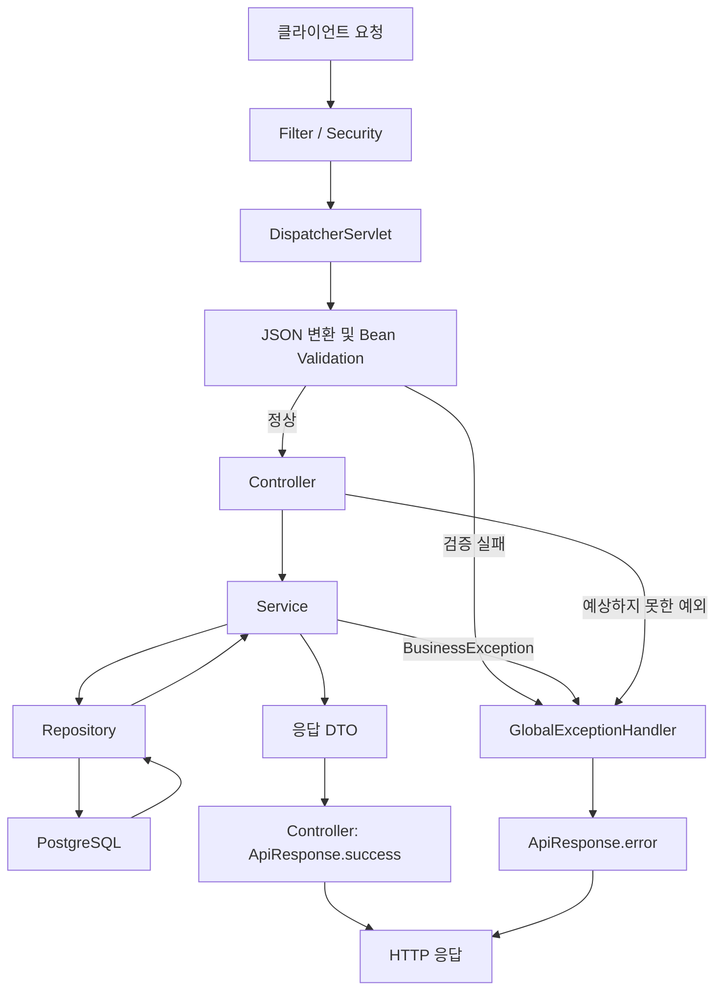

# Backend 공통 설정 가이드

이 문서는 백엔드 API의 공통 응답, 오류 처리, JPA Auditing 규칙과 사용 방법을 설명합니다.

## 적용 범위

- 일반 JSON 성공 응답은 `ApiResponse<T>`로 감쌉니다.
- 일반 JSON 오류 응답도 `ApiResponse<T>` 형식으로 반환합니다.
- 추가 응답 데이터가 없는 경우 `data`는 JSON에서 생략합니다.
- 필드 검증 오류는 `data.fieldErrors`에 포함합니다.
- 응답 본문을 감싸더라도 상황에 맞는 HTTP 상태 코드를 사용합니다.
- 서비스 계층은 HTTP 응답 타입에 의존하지 않습니다.
- JPA 엔티티의 생성·수정 시간은 `BaseTimeEntity`로 관리합니다.

다음 응답에는 공통 래퍼를 적용하지 않습니다.

- `204 No Content`
- 파일 다운로드
- 이미지·영상 스트리밍
- Server-Sent Events
- Actuator
- Swagger와 OpenAPI
- 외부 시스템이 규격을 지정한 Webhook

## 패키지 구조

```text
org.ssafy.b102.backend.global
├── common
│   ├── entity
│   │   └── BaseTimeEntity
│   └── response
│       ├── ApiResponse
│       ├── ValidationError
│       └── ValidationErrorResponse
├── config
│   └── JpaAuditingConfig
└── error
    ├── ErrorCode
    ├── CommonErrorCode
    ├── BusinessException
    └── GlobalExceptionHandler
```

## API 처리 흐름



성공 응답은 컨트롤러가 만들고, 오류 응답은 `GlobalExceptionHandler`가 만듭니다. 서비스는 성공 시 응답 DTO를 반환하고, 비즈니스 규칙 위반 시 `BusinessException`을 발생시킵니다.

## 공통 응답 구조

`ApiResponse<T>`는 다음 필드로 구성됩니다.

| 필드 | 타입 | 설명 |
| --- | --- | --- |
| `code` | `String` | 클라이언트가 분기 처리할 응답 코드 |
| `message` | `String` | 사용자에게 제공할 안전한 메시지 |
| `data` | `T` | 추가 응답 데이터. 값이 `null`이면 JSON에서 생략 |

`code`와 `message`는 일반 JSON 응답에 항상 포함합니다.
`data`는 전달할 추가 정보가 있을 때만 포함합니다.

`204 No Content`는 공통 응답 객체를 반환하지 않고 응답 본문 자체를 비웁니다.

### 성공 응답

```json
{
  "code": "SUCCESS",
  "message": "요청에 성공했습니다.",
  "data": {
    "id": 1,
    "name": "홍길동"
  }
}
```

컨트롤러에서는 다음과 같이 반환합니다.

```java
@GetMapping("/{memberId}")
public ResponseEntity<ApiResponse<MemberResponse>> getMember(
    @PathVariable Long memberId
) {
    MemberResponse response = memberService.getMember(memberId);

    return ResponseEntity.ok(ApiResponse.success(response));
}
```

리소스 생성은 실제 HTTP 상태를 `201 Created`로 반환합니다.

```java
return ResponseEntity
    .status(HttpStatus.CREATED)
    .body(ApiResponse.success(response));
```

응답 메시지를 변경해야 할 때만 메시지를 직접 지정합니다.

```java
ApiResponse.success("회원 생성에 성공했습니다.", response);
```

### 오류 응답

```json
{
  "code": "MEMBER-001",
  "message": "회원을 찾을 수 없습니다."
}
```

오류 응답을 커스텀 형식으로 반환하더라도 오류를 `200 OK`로 반환하지 않습니다.

### 검증 오류 응답

```json
{
  "code": "COMMON-001",
  "message": "요청 값이 올바르지 않습니다.",
  "data": {
    "fieldErrors": [
      {
        "field": "email",
        "reason": "이메일 형식이 올바르지 않습니다."
      }
    ]
  }
}
```

여러 입력 필드의 검증 오류는 `data.fieldErrors`에 포함합니다.
보안상 사용자가 입력한 `rejectedValue`는 응답에 포함하지 않습니다.

## HTTP 상태 사용 규칙

| 상황 | HTTP 상태 |
| --- | ---: |
| 조회·수정 성공 | `200 OK` |
| 생성 성공 | `201 Created` |
| 본문 없는 삭제 성공 | `204 No Content` |
| 잘못된 요청 또는 검증 실패 | `400 Bad Request` |
| 인증 실패 | `401 Unauthorized` |
| 권한 부족 | `403 Forbidden` |
| 리소스 없음 | `404 Not Found` |
| 지원하지 않는 HTTP 메서드 | `405 Method Not Allowed` |
| 중복 또는 상태 충돌 | `409 Conflict` |
| 지원하지 않는 미디어 타입 | `415 Unsupported Media Type` |
| 예상하지 못한 서버 오류 | `500 Internal Server Error` |

## 오류 코드

모든 오류 코드는 `ErrorCode`를 구현합니다.

```java
public interface ErrorCode {
    HttpStatus status();
    String code();
    String message();
}
```

공통 오류만 `CommonErrorCode`에 둡니다.

| 상수 | 코드 | HTTP 상태 | 용도 |
| --- | --- | ---: | --- |
| `INVALID_INPUT` | `COMMON-001` | 400 | Bean Validation 등 잘못된 입력 |
| `MALFORMED_JSON` | `COMMON-002` | 400 | 읽을 수 없는 JSON 본문 |
| `MISSING_PARAMETER` | `COMMON-003` | 400 | 필수 파라미터 누락 |
| `TYPE_MISMATCH` | `COMMON-004` | 400 | 파라미터 타입 불일치 |
| `RESOURCE_NOT_FOUND` | `COMMON-404` | 404 | 존재하지 않는 API 또는 리소스 |
| `METHOD_NOT_ALLOWED` | `COMMON-405` | 405 | 지원하지 않는 HTTP 메서드 |
| `NOT_ACCEPTABLE` | `COMMON-406` | 406 | 제공할 수 없는 응답 미디어 타입 |
| `MEDIA_TYPE_NOT_SUPPORTED` | `COMMON-415` | 415 | 지원하지 않는 요청 미디어 타입 |
| `INTERNAL_SERVER_ERROR` | `COMMON-500` | 500 | 예상하지 못한 서버 오류 |

도메인 오류는 각 도메인 내부에 둡니다.

```text
member/
└── exception/
    └── MemberErrorCode.java
```

```java
public enum MemberErrorCode implements ErrorCode {
    MEMBER_NOT_FOUND(
        HttpStatus.NOT_FOUND,
        "MEMBER-001",
        "회원을 찾을 수 없습니다."
    ),
    EMAIL_ALREADY_EXISTS(
        HttpStatus.CONFLICT,
        "MEMBER-002",
        "이미 사용 중인 이메일입니다."
    );
}
```

권장 코드 형식은 `<DOMAIN>-<NUMBER>`입니다. 이미 사용한 코드는 의미를 바꾸거나 다른 오류에 재사용하지 않습니다.

## BusinessException 사용

서비스에서 비즈니스 규칙 위반을 발견하면 `BusinessException`을 발생시킵니다.

```java
@Transactional(readOnly = true)
public MemberResponse getMember(Long memberId) {
    Member member = memberRepository.findById(memberId)
        .orElseThrow(() -> new BusinessException(MemberErrorCode.MEMBER_NOT_FOUND));

    return MemberResponse.from(member);
}
```

서비스에서는 다음 타입을 반환하지 않습니다.

- `ApiResponse`
- `ResponseEntity`
- HTTP 응답 전용 DTO

서비스는 응답 DTO를 반환하거나 예외를 발생시키고, HTTP 응답은 컨트롤러와 전역 예외 처리기가 담당합니다.

## 전역 예외 처리

`GlobalExceptionHandler`는 `ResponseEntityExceptionHandler`를 상속하며 다음 오류를 공통 응답으로 변환합니다.

| 예외 | 응답 |
| --- | --- |
| `BusinessException` | 예외가 가진 `ErrorCode`의 상태와 코드 |
| `MethodArgumentNotValidException` | 400, `COMMON-001`, 필드 오류 포함 |
| `HandlerMethodValidationException` | 400, `COMMON-001`, 파라미터 오류 포함 |
| `ConstraintViolationException` | 400, `COMMON-001`, 제약 조건 오류 포함 |
| `HttpMessageNotReadableException` | 400, `COMMON-002` |
| 필수 파라미터 누락 | 400, `COMMON-003` |
| 타입 불일치 | 400, `COMMON-004` |
| 지원하지 않는 HTTP 메서드 | 405, `COMMON-405` |
| 존재하지 않는 MVC 리소스 | 404, `COMMON-404` |
| 지원하지 않는 요청 미디어 타입 | 415, `COMMON-415` |
| 그 외 예상하지 못한 예외 | 500, `COMMON-500` |

예상하지 못한 예외는 전체 스택 트레이스를 `error` 로그에 기록하고, 클라이언트에는 안전한 공통 메시지만 반환합니다. 예외 클래스, 스택 트레이스, SQL, 파일 경로와 내부 예외 메시지를 응답에 포함하면 안 됩니다.

## Spring 설정

공통 `application.yml`에서는 ProblemDetail을 사용하지 않도록 명시하고, Spring Boot의 기본 `/error` 응답에서 내부 정보가 노출되지 않도록 설정합니다.

```yaml
spring:
  mvc:
    problemdetails:
      enabled: false
  web:
    error:
      include-exception: false
      include-message: never
      include-stacktrace: never
      include-binding-errors: never
      include-path: always
```

공통 API 응답의 Content-Type은 `application/json`입니다. `application/problem+json`은 사용하지 않습니다.

## JPA Auditing

생성·수정 시간이 필요한 JPA 엔티티는 `BaseTimeEntity`를 상속합니다.

```java
@Entity
public class Member extends BaseTimeEntity {
    // 도메인 필드
}
```

저장할 때 `createdAt`과 `updatedAt`이 자동으로 기록되고, 수정할 때 `updatedAt`만 갱신됩니다. 시간 타입은 서버 시간대에 영향을 덜 받는 `Instant`를 사용합니다.

`JpaAuditingConfig`의 `@EnableJpaAuditing`이 이 동작을 활성화합니다. 엔티티 ID는 도메인마다 생성 전략이 다를 수 있으므로 `BaseTimeEntity`에 포함하지 않습니다. 작성자 추적이 실제로 필요해질 때 `createdBy`, `updatedBy`, `AuditorAware`를 추가합니다.

## 현재 경계와 확장 지점

현재 `GlobalExceptionHandler`는 Spring MVC 안에서 발생한 예외를 처리합니다. 다음 단계에서 Spring Security나 별도 Servlet Filter를 추가하면 MVC 진입 전에 발생하는 오류도 동일한 형식으로 맞춰야 합니다.

- 인증 실패: 커스텀 `AuthenticationEntryPoint`
- 인가 실패: 커스텀 `AccessDeniedHandler`
- 필터 단계 오류: 필터 내부 예외 처리 또는 `/error` 커스터마이징
- MVC 밖의 최종 오류 형식 통일: 커스텀 `ErrorController` 또는 `ErrorAttributes`

`ResponseBodyAdvice`를 사용한 자동 응답 래핑은 현재 적용하지 않습니다. 이중 래핑, 문자열·파일 응답 처리 및 OpenAPI 문서 불일치 가능성이 있어 컨트롤러에서 명시적으로 `ApiResponse.success(...)`를 사용합니다.

## 테스트 실행

JPA Auditing 통합 테스트는 로컬 PostgreSQL을 사용합니다. `backend/`에서 PostgreSQL을 먼저 실행합니다.

```bash
docker compose -f compose.yml up -d postgres
```

Windows PowerShell 또는 명령 프롬프트:

```powershell
.\gradlew.bat test
```

Git Bash, macOS, Linux:

```bash
./gradlew test
```

테스트는 다음 동작을 검증합니다.

- 성공·실패 `ApiResponse` 생성
- `BusinessException`의 오류 코드 유지
- 검증·JSON·HTTP 메서드·비즈니스·서버 오류 변환
- 내부 예외 메시지 미노출
- 엔티티 저장·수정 시 Auditing 시간 자동 기록
